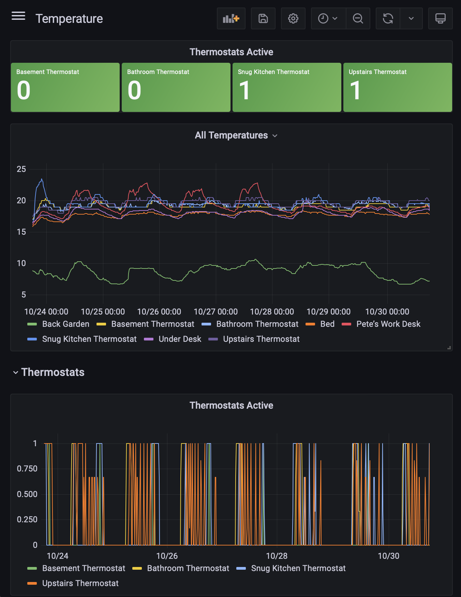
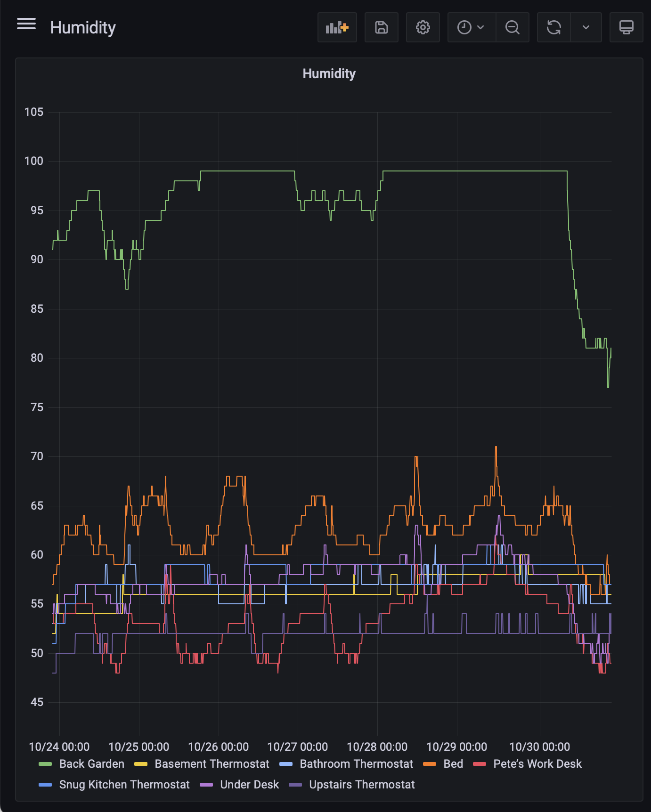
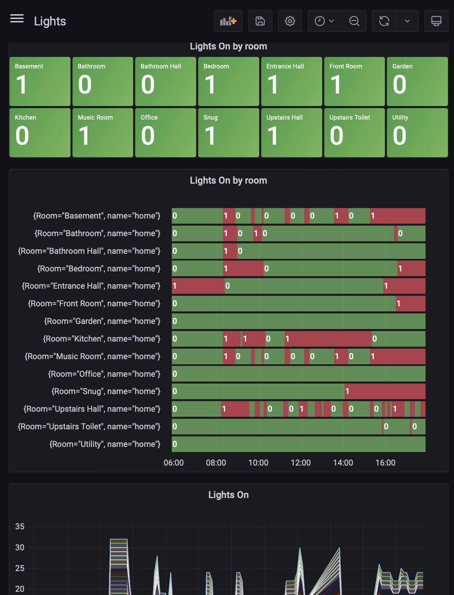

# HomekitDataExporter

HomeKit is Apple's solution for managing all of a home's smart accesories. This is a simple utility application created to store HomeKit device properties over time such that historic data can easily be explored in charts and graphs.

## Overview

HomeKit is a great for integrating all sorts of devices and for anything not officially supported you can likely use [HomeBridge](https://homebridge.io) to add it. With these tools you can acquire data for all sorts of temperature sensor, light bulbs, thermostats etc. However, there is no easy way to visualise trends in the properties of the devices over time (i.e. changing temperature in each room). 

This app tries to provide a solution by regularly polling HomeKit to detect device states and then storing the values in a timeseries database so they can be visualised. The database and visualisation tools which are outlined are InfluxDB and Grafana. These are designed for storing and visualising data at massive scale so should easily cope with a single home.

The app is a Mac Catalyst app which needs to run continuously. If you have a spare Mac Mini or already have a Mac running [HomeBridge](https://homebridge.io) that will be ideal.

Once setup, you can access the Grafana console for anywhere on you local network and can explore all the dashboards you have created.

As soon as a new device is added to a home it should immediately be detectd by the app. Equally if new numeric properties are exposd for a device within HomeKit these will start to appear as tags without the need for any changes.

### InfluxDB fields and tags

InfluxDB stores each measurement as a field and value with associated tags. The tags allow filters to be creatd grouping values using different properties. This app extracts all the properties it can for each of the available devices and their measurements in a home.

Example fileds are:
* Brightness
* Hue
* Current Temperature
* Target Temperature

Example tags are:
* Home
* Room
* Accessory Type

Once the app is installed and running, you can explore these fields in InfluxDB or in the app itself.

## Setup

### Installing InfluxDB and Grafana

The application can send data to any InfluxDB instance. The following steps indicate how to set this up using Docker containers for both the InfluxDB and Grafana

1. Install [Docker](https://docs.docker.com/desktop/install/mac-install/)
1. Install [Homebrew](https://docs.brew.sh/Installation) - while not strictly neccessary Homebrew makes package management much simpler.
1. Open a terminal and use the newly installed Homebrew to install docker-compose - `brew install docker-compose`
1. To run docker-compose a number of the docker executables need to be on the terminal's path. These are likely in the following locations:
1.- Apple Silicon `/Applications/Docker.app/Contents/Resources/bin/`
1.- Intel Mac `~/.docker/bin/`
1. To add the location to the terminal's path simply run export `export PATH=$PATH:~/.docker/bin/` (using the appropriate location). 
1. Download the [docker-statsd-influxdb-grafana git project](https://github.com/samuelebistoletti/docker-statsd-influxdb-grafana). If you don't use git regularly you can just download the zip archive of the project.
1. In a terminal navigate to the location of the root of the 'docker-statsd-influxdb-grafana' project.
1. Run `COMPOSE_PROFILES=grafana docker-compose up -d` to start the containers.

### Configure InfluxDB

The default parameters in the InfluxDB container should work well. However, if you wish to change anything you can access InfluxDB from any browser at http://localhost:8086/. The default username is `admin` and the password is `admin123456`.

### Configure Grafana

Grafana should be preconfigured to have the InfluxDB instance as a datasource. To access the Grafana instance visit http://localhost:3000 from any browser. The default username is `admin` and the password is `admin`.

### Building the application

The application has not been packaged for distribution on the app store. That saves on the anual Apple Developer subscription fee. However, it does unfortunately mean that anyone wishing to run the project will have to build it themselves. Once built the project can then only then be run from within Xcode. 

1. Download Xcode on the computer the app will run on. Xcode can be found on the Apple appstore.
1. Open Xcode and when asked choose to install the iOS 17 resources
1. You will need a personal certificate to sign the application.
1.1. Go to Settings / Accounts
1.1. Your Apple ID should be listed or you can add it by clicking on the `+` in the bottom corner.
1.1. Choose `Manage Certificates` and add a new developer certificate. 
1.1. You should see 'FirstName LastName (Personal Team)' listed
1.1. Close the settings and return to the project
1. Click on `HomekitDataExporter` in the project navigator to open the project settings.
1. Open the `Signing and Capabilities` tab
1. For `Team` choose 'FirstName LastName (Personal Team)'
1. Now build and run the project using the play button at the top of the Xcode window. If not preselected the target should be 'My Mac (Mac Catalyst)`
1. If all goes well the app window should open

## Using the app

The UI of the app is a bit rough and ready but you probably won't need to spend much time in it. There are just two tabs:
* Influx Export Settings
* Home Explorer

### Home Explorer

The 'Home Explorer' allows you to navigate through the set of devices and devce measurements which will be exported to InfluxDB. For each individual measurement you should see the measurment's current value and all the tags and values associated whiche were obtained for the measurement.

### Influx Export Settings

This tab allows the InfluxDB connection to be setup. If you are using the default properties the settings will be:
* Bucket `mybucket`
* Organisation `myorganization`
* Token `myadmintoken`
* URL `http://localhost:8086`

Once these are added click `Test Connection`. The result will either be `Success` or a listed error message.

If the connection is successful the app will continue to send HomeKit measurements to the database every 5 minutes. The sttings are stored locally so should be maintained between restarts of the app. On any restart, as long as the settings are present the app will automatically staret connecting.

## A first graph

Grafana is a very powerful visualisation tool. If it is new to you there are many good tutorials online. When creating charts in Grafana you will use the Flux language to define the queries. This is an example of a query to chart all the thermostats and temperature senors in a home:

`from(bucket: "mybucket")
  |> range(start: v.timeRangeStart, stop: v.timeRangeStop)
  |> filter(fn: (r) => r["_field"] == "Current Temperature")
  |> drop(columns: ["_field", "Accessory", "AccessoryId", "AccessoryType", "Firmware Version", "Home", "Model", "Serial Number", "Manufacturer", "Room", "ServiceType"])
  |> aggregateWindow(every: v.windowPeriod, fn: mean, createEmpty: false)
  |> yield(name: "mean")`

The `drop(columns:` line removes all the unnessessary columns so the labels in the chart are nice and simple. 

Instead of creating queries from scratch you may wish to use the data explorer in the InfluxDB console. From there you can export queries and then simply tweak them as neede in Grafana.

That's it really! Enjoy exploring and do share any suggestions, improvements, or interesting visualisations.

## Example dashboards

